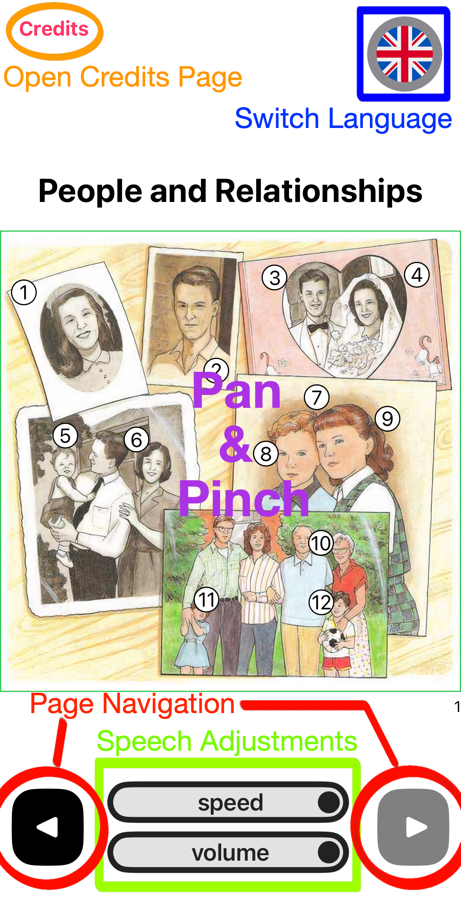

# Introduction

The Oxford Picture Dictionary was made based on 
[The New Oxford Picture Dictionary: Monolingual English Edition](https://homepage.ntu.edu.tw/~karchung/OxfordPictureDictionary.pdf)
by Parnwell et al. at Oxford University Press. In the first paragraph
of the Preface, the authors have described the book as:

> The *New Oxford Picture Dictionary* contextually illustrates over
2,400 words. The book is a unique language learning tool for
students of English. It provides students a glance at American
lifestyle, as well as compendium of useful vocabulary.

### In this project, I have:
* Greatly improved image resolution by utilizing [AI Image enhancement](https://letsenhance.io/boost)
* Made numbered tags interactive
* Implemented pan and pinch
* Made vocabulary audible
* Implemented multilingual feature

### Using Oxford Picture Dictionary
The Oxford Picture Dictionary is designed for easy use. 
Simply click a numbered tag on the image to display the vocabulary, 
along with its pronunciation.

### Other controls

    

# Download

### Development
Requirement: MacOS system with XCode downloaded.

Clone this repository and open it in XCode. Trust the project,
build and run with a device of your choice. 
### App Store
Not yet available.

### TestFlight
Not yet available.

# Share the app
This app is offered entirely free as an English learning tool, 
in recognition of Oxford University Press's generosity in sharing 
educational resources. In that spirit, **I encourage any derivative 
works based on this app to also be made freely available and open 
to the public.** Beyond that, you are welcome to build upon and expand 
this project with your own ideas.

# Helping with Translation
To help, please go to [this google sheet](https://docs.google.com/spreadsheets/d/1_eBhGagpQ7aI7Gpe-YDquEc05Ku1f8Eoi5rRgc3CAz4/edit?usp=sharing).
If you contribute high-quality translations, your name will be 
proudly featured on the Credits page.

If you wish to add a new language or if you have found a translation error, 
please contact me via email:
kolynlin@protonmail.com
